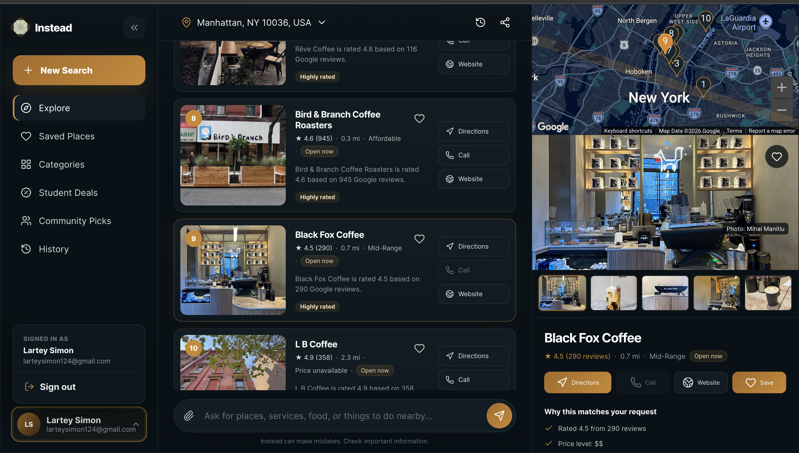

# Instead


Instead is an AI-powered local discovery platform that helps students, newcomers, and young professionals find businesses, services, and places that match their needs, budget, location, and preferences.

Rather than forcing users to translate natural needs into rigid keywords, Instead supports conversational discovery. A user can begin with a request such as:

> Find an affordable quiet café near campus where I can study.

Then continue naturally:

> Which one is closest?
>
> Only show places that are open now and rated at least 4.5.
>
> Find a barber for textured hair instead.



> **Project status:** Active development

## Table of Contents

- [Overview](#overview)
- [Key Features](#key-features)
- [How It Works](#how-it-works)
- [Technology Stack](#technology-stack)
- [Project Structure](#project-structure)
- [Getting Started](#getting-started)
- [Configuration](#configuration)
- [Database Migrations](#database-migrations)
- [Running the Application](#running-the-application)
- [Testing and Quality Checks](#testing-and-quality-checks)
- [API Overview](#api-overview)
- [Deployment](#deployment)
- [Development Workflow](#development-workflow)
- [Security](#security)
- [Current Limitations](#current-limitations)
- [Roadmap](#roadmap)
- [Contributing](#contributing)
- [License](#license)

## Overview

Instead combines structured local-search constraints with conversational AI. The application interprets a user’s request, retrieves candidate places, applies hard filters, ranks the remaining results, and presents recommendations through an interactive dashboard.

The platform is designed around two core product areas:

1. **Personalized local discovery** — search for places using natural language, structured filters, location, and follow-up conversation.
2. **Student deals** — allow businesses to submit student offers and support moderation workflows before publication.

The codebase uses a modular Flask architecture with separate models, providers, repositories, schemas, services, routes, templates, and static assets.

## Key Features

### Natural-language local search

Users can describe what they need in ordinary language instead of selecting a fixed category first. Search requests may include preferences related to:

- place or service type;
- price level;
- current open status;
- minimum rating;
- maximum distance;
- location;
- atmosphere, purpose, and other qualitative preferences.

### Conversational follow-ups

Instead preserves the active search session and classifies follow-up messages into one of four actions:

- `answer_existing` — answer a question using the current recommendations;
- `refine_results` — merge additional constraints into the current search and retrieve updated results;
- `run_new_search` — search for a different kind of place while preserving relevant session context;
- `clarify` — ask a focused question when the follow-up is too ambiguous to act on safely.

### Structured, server-side filters

The backend validates and enforces structured filters for:

- `price_levels`;
- `open_now`;
- `minimum_rating`;
- `max_distance_meters`.

The dashboard supports multi-select filters and synchronizes visible filter state after conversational refinements.

### Result ranking and fallback handling

Retrieved candidates pass through validation, filtering, fallback selection, and relevance ranking. When no candidate satisfies every active constraint, the API can return clearly labeled fallback alternatives rather than presenting them as exact matches.

### Search-session continuity

An active search session stores:

- the original query;
- interpreted search intent;
- location;
- active filters;
- retrieved candidates;
- ranked results;
- conversation history;
- session identifier and creation time.

This enables multi-step conversations without forcing the user to restart the search.

### Live and local provider modes

Provider abstractions support both development and production-style workflows:

- mock Places provider for deterministic local development and tests;
- Google Places provider for live local-business retrieval;
- fake assistant provider for development and automated tests;
- OpenAI assistant and conversation-decision providers for AI-backed behavior.

### Interactive discovery dashboard

The dashboard supports:

- result cards;
- map-based discovery;
- result counts and status messages;
- synchronized filters;
- conversational follow-ups;
- result replacement after refinements and new searches;
- place actions such as directions and external links when available.

### Authentication

The application includes:

- Google OAuth;
- login and signup pages;
- session-based authentication;
- protected dashboard access;
- configurable administrative authorization.

### Student deals and moderation

The codebase includes models, schemas, services, and API routes for student deals, including:

- merchant deal submission;
- structured deal validation;
- deal URLs and business URLs;
- moderation states;
- administrative approval and rejection workflows.

### Reliability and validation

The application includes:

- strict request-schema validation;
- controlled provider error responses;
- provider abstractions for testability;
- logging for provider and orchestration failures;
- explicit request timeouts;
- validation of malformed AI decisions;
- unit and integration test coverage.

## How It Works

### Initial search flow

```text
User request
    ↓
Request validation
    ↓
Intent extraction
    ↓
Places retrieval
    ↓
Hard-filter enforcement
    ↓
Fallback handling
    ↓
Relevance ranking
    ↓
Assistant response generation
    ↓
Search-session creation
    ↓
Dashboard rendering
```

### Conversational follow-up flow

```text
Follow-up message
    ↓
Conversation orchestrator
    ↓
Decision provider
    ├── answer_existing
    ├── refine_results
    ├── run_new_search
    └── clarify
    ↓
Search or conversation update
    ↓
Session persistence
    ↓
Dashboard refresh
```

## Technology Stack

### Backend

- Python
- Flask
- Flask-SQLAlchemy
- Flask-Migrate / Alembic
- Flask-Dance
- OpenAI Python SDK
- Requests
- Gunicorn

### Data

- SQLite for local development
- PostgreSQL for production
- SQLAlchemy ORM

### Frontend

- HTML
- CSS
- JavaScript
- Jinja templates
- Google Maps JavaScript integration when configured

### External services

- OpenAI API
- Google OAuth
- Google Places API
- Google Maps JavaScript API

### Testing and delivery

- Pytest
- pytest-cov
- Flask test client
- GitHub pull-request workflow
- Heroku-compatible `Procfile`

## Project Structure

Generated files such as `__pycache__`, `.pyc` files, local databases, virtual environments, and environment files are intentionally omitted from this overview.

```text
cityguide-ai/
├── app/
│   ├── models/                  # Domain and database models
│   ├── oauth/                   # Google OAuth configuration
│   ├── providers/
│   │   ├── assistant/           # Fake and OpenAI assistant providers
│   │   └── places/              # Mock and Google Places providers
│   ├── repositories/            # Search-session repository abstractions
│   ├── routes/
│   │   ├── api/                 # Search, deals, and moderation APIs
│   │   ├── auth.py              # Authentication routes
│   │   └── main.py              # Page routes
│   ├── schemas/                 # Request validation and serialization
│   ├── services/                # Search, ranking, conversation, and deal logic
│   ├── static/
│   │   ├── css/
│   │   ├── images/
│   │   └── js/
│   ├── templates/               # Jinja templates
│   ├── authentication.py
│   ├── extensions.py
│   └── __init__.py              # Flask application factory
├── docs/
│   └── screenshot-dashboard.png # README product screenshot
├── migrations/                  # Alembic migration environment and revisions
├── tests/                       # Unit and integration tests
├── .env.example                 # Environment-variable template
├── .gitignore
├── .python-version
├── config.py                    # Application configuration
├── Procfile                     # Heroku release and web processes
├── pytest.ini                   # Pytest configuration
├── requirements.txt             # Python dependencies
├── run.py                       # Application entry point
└── README.md
```

## Getting Started

### Prerequisites

Install the following before running the project locally:

- Python 3.11 or a compatible supported version;
- Git;
- Node.js only for JavaScript syntax checks;
- PostgreSQL only when testing with a production-style database.

External API credentials are optional when using the mock and fake providers.

### 1. Clone the repository

```bash
git clone https://github.com/simonlartey/Instead-ai.git
cd Instead-ai
```

### 2. Create and activate a virtual environment

macOS or Linux:

```bash
python -m venv .venv
source .venv/bin/activate
```

Windows PowerShell:

```powershell
python -m venv .venv
.venv\Scripts\Activate.ps1
```

### 3. Install dependencies

```bash
python -m pip install --upgrade pip
pip install -r requirements.txt
```

### 4. Create the environment file

```bash
cp .env.example .env
```

Update `.env` with the values required for the provider modes you intend to use. The default mock and fake modes do not require live API credentials.

### 5. Apply database migrations

```bash
flask --app run.py db upgrade
```

### 6. Start the development server

```bash
python run.py
```

The application is normally available at:

```text
http://127.0.0.1:5000
```

## Configuration

Configuration is loaded from environment variables through `config.py`. Never commit a populated `.env` file.

| Variable | Required | Default | Purpose |
|---|---:|---|---|
| `SECRET_KEY` | Production | Development fallback | Signs Flask session data. Use a strong random value in production. |
| `DATABASE_URL` | Production | Local SQLite database | SQLAlchemy database connection string. |
| `GOOGLE_OAUTH_CLIENT_ID` | For Google login | None | Google OAuth client ID. |
| `GOOGLE_OAUTH_CLIENT_SECRET` | For Google login | None | Google OAuth client secret. |
| `PLACES_PROVIDER` | No | `mock` | Places implementation. Supported values: `mock`, `google`. |
| `PLACES_API_KEY` | For live Places | None | Google Places API key. |
| `PLACES_REQUEST_TIMEOUT_SECONDS` | No | `10` | Timeout for Places requests. |
| `MAPS_JAVASCRIPT_API_KEY` | For live maps | None | Google Maps JavaScript API key exposed to the dashboard through server configuration. |
| `GOOGLE_MAP_ID` | Optional | None | Google Map ID for map styling or advanced markers. |
| `ASSISTANT_PROVIDER` | No | `fake` | Assistant implementation. Supported values: `fake`, `openai`. |
| `OPENAI_API_KEY` | For OpenAI mode | None | OpenAI API credential. |
| `ASSISTANT_MODEL` | For OpenAI mode | None | OpenAI model used by assistant providers. |
| `ADMIN_EMAILS` | For moderation access | None | Comma-separated list of authorized administrator email addresses when supported by the active configuration. |
| `FLASK_ENV` | No | Development behavior | Set to `production` to enable production cookie behavior. |
| `OAUTHLIB_INSECURE_TRANSPORT` | Local OAuth only | Disabled | Allows OAuth over local HTTP. Never enable in production. |

A local development configuration can use:

```env
SECRET_KEY=replace-with-a-local-development-secret
DATABASE_URL=sqlite:///cityguide.db

PLACES_PROVIDER=mock
PLACES_REQUEST_TIMEOUT_SECONDS=10

ASSISTANT_PROVIDER=fake

GOOGLE_OAUTH_CLIENT_ID=
GOOGLE_OAUTH_CLIENT_SECRET=
PLACES_API_KEY=
MAPS_JAVASCRIPT_API_KEY=
GOOGLE_MAP_ID=
OPENAI_API_KEY=
ASSISTANT_MODEL=
ADMIN_EMAILS=
```

For live AI and place retrieval:

```env
PLACES_PROVIDER=google
PLACES_API_KEY=your-google-places-key
MAPS_JAVASCRIPT_API_KEY=your-google-maps-key

ASSISTANT_PROVIDER=openai
OPENAI_API_KEY=your-openai-key
ASSISTANT_MODEL=your-configured-model
```

## Database Migrations

Create a migration after changing SQLAlchemy models:

```bash
flask --app run.py db migrate -m "describe the schema change"
```

Review the generated migration before applying it.

Apply all pending migrations:

```bash
flask --app run.py db upgrade
```

Show the current migration revision:

```bash
flask --app run.py db current
```

View migration history:

```bash
flask --app run.py db history
```

Do not edit a migration that has already been applied in a shared or production environment. Create a new corrective migration instead.

## Running the Application

### Development server

```bash
python run.py
```

### Production-style local server

```bash
gunicorn run:app
```

### Provider modes

Use deterministic providers during development and automated tests:

```env
PLACES_PROVIDER=mock
ASSISTANT_PROVIDER=fake
```

Use live providers only after configuring the required credentials:

```env
PLACES_PROVIDER=google
ASSISTANT_PROVIDER=openai
```

## Testing and Quality Checks

Run the complete test suite:

```bash
pytest
```

Run a focused test module:

```bash
pytest tests/test_search_api.py -q
```

Run a single test:

```bash
pytest tests/test_search_api.py::test_search_session_supports_multi_step_conversation_flow -q
```

Generate a coverage report:

```bash
pytest --cov=app --cov-report=term-missing
```

Compile Python modules:

```bash
python -m compileall app
```

Check dashboard JavaScript syntax:

```bash
node --check app/static/js/dashboard.js
```

Check for whitespace errors:

```bash
git diff --check
```

Recommended pre-commit verification:

```bash
python -m compileall app
node --check app/static/js/dashboard.js
pytest
git diff --check
git status
```

The test suite covers application setup, authentication, OAuth, providers, schemas, filtering, ranking, search sessions, conversational actions, student deals, moderation, error handling, and multi-step integration flows.

## API Overview

The primary search blueprint is exposed under `/api/v1`.

### Start a search

```http
POST /api/v1/search
Content-Type: application/json
```

Example request:

```json
{
  "query": "Affordable barber near campus",
  "location": {
    "latitude": 43.6591,
    "longitude": -70.2568
  },
  "filters": {
    "price_levels": [1, 2],
    "open_now": true,
    "minimum_rating": 4.5,
    "max_distance_meters": 5000
  }
}
```

Example response shape:

```json
{
  "search_id": "search-session-uuid",
  "query": "Affordable barber near campus",
  "result_count": 3,
  "results": [],
  "assistant_response": "I found several options that match your request.",
  "filter_status": {
    "mode": "exact",
    "title": null,
    "message": null
  }
}
```

### Retrieve a search session

```http
GET /api/v1/search/{session_id}
```

### Continue a search conversation

```http
POST /api/v1/search/{session_id}/continue
Content-Type: application/json
```

Example request:

```json
{
  "message": "Only show places that are open now"
}
```

Possible response actions:

```text
answer_existing
refine_results
run_new_search
clarify
```

Result-changing actions return updated results, active filters, result counts, and filter status while preserving the same session.

### Discovery endpoint

```http
POST /api/v1/discovery
Content-Type: application/json
```

This endpoint supports discovery-oriented requests used by the application’s local recommendation experience.

### Place-photo proxy

```http
GET /api/v1/place-photo
```

This endpoint retrieves configured place photos without exposing provider implementation details directly in the frontend.

### Student-deal endpoints

The project includes API modules for student-deal submission and moderation. Refer to:

```text
app/routes/api/deals.py
app/routes/api/deal_moderation.py
```

for the currently registered request paths, authorization requirements, and response schemas.

## Deployment

The included `Procfile` is compatible with Heroku-style deployments:

```procfile
release: flask --app run.py db upgrade
web: gunicorn run:app
```

The release process applies database migrations before the web process starts.

### Production requirements

Before deploying, configure at minimum:

- a strong `SECRET_KEY`;
- `DATABASE_URL` for PostgreSQL;
- live provider credentials when live providers are enabled;
- Google OAuth credentials when authentication is enabled;
- administrative access settings;
- `FLASK_ENV=production` or the platform’s equivalent production configuration.

### Deployment verification

After deployment:

1. confirm migrations completed successfully;
2. verify the landing page and authentication flow;
3. test an initial search;
4. test an existing-result question;
5. test a conversational refinement;
6. test a conversational new search;
7. verify map and place-photo behavior;
8. verify student-deal authorization and moderation where enabled;
9. review application logs for provider or migration errors.

## Development Workflow

Direct commits to `main` are protected. Use a feature branch and pull request for every change.

### Create a branch

```bash
git checkout main
git pull origin main
git checkout -b feature/your-feature-name
```

### Make focused changes

Keep commits small and avoid mixing unrelated concerns.

```bash
git add <changed-files>
git diff --cached --check
git diff --cached --stat
git diff --cached
git commit -m "feat(scope): describe the change"
```

### Push and open a pull request

```bash
git push -u origin feature/your-feature-name
```

Open a pull request into `main`, link the related issue, document the change, and include verification results.

### Commit convention

Use conventional, scoped commit messages:

```text
feat(search): support conversational refinement
fix(search): add timeout to decision client
test(search): cover conversational search flow
refactor(search): extract search execution
docs(readme): update project documentation
```

Common prefixes:

- `feat` — new user-facing or internal capability;
- `fix` — defect correction;
- `test` — test-only changes;
- `refactor` — structural change without intended behavior change;
- `docs` — documentation;
- `chore` — maintenance or tooling.

## Security

- Never commit `.env`, API keys, OAuth secrets, database credentials, or private tokens.
- Use a strong random `SECRET_KEY` in production.
- Keep production database credentials restricted to the application environment.
- Validate all client input and external-provider output.
- Avoid logging full conversation content, secrets, precise personal data, or unnecessary identifiers.
- Keep OAuth callback validation enabled.
- Use HTTPS in production.
- Do not enable `OAUTHLIB_INSECURE_TRANSPORT` outside local development.
- Rotate credentials immediately if they are exposed.
- Review dependency updates and provider SDK changes before deployment.
- Treat moderation endpoints as privileged operations and verify authorization in tests.

To report a security issue, email [larteysimon124@gmail.com](mailto:larteysimon124@gmail.com) privately rather than opening a public issue containing exploit details or credentials.

## Current Limitations

Instead is under active development. Current limitations include:

- active conversational search sessions use an in-memory repository and do not survive process restarts;
- recommendation quality depends on the configured provider and the completeness of provider data;
- semantic vector retrieval and an Instead-owned place-attribute corpus are not yet implemented;
- behavioral personalization and learning-to-rank are not yet implemented;
- retries, structured search analytics, and provider-latency monitoring are planned improvements;
- availability and quality of live place photos, ratings, prices, and opening hours depend on upstream data.

## Roadmap

### Phase 1 — Search correctness and reliability

- [x] Functional multi-select filters
- [x] Structured server-side filter state
- [x] Hard-filter enforcement
- [x] Conversational follow-up classification
- [x] Fresh retrieval for conversational refinements
- [x] Provider error handling
- [x] OpenAI request timeout
- [ ] Structured search analytics
- [ ] Bounded retry handling
- [ ] Provider-latency monitoring

### Phase 2 — Retrieval quality

- [ ] Multi-query Places retrieval
- [ ] Candidate deduplication
- [ ] Continuous distance scoring
- [ ] Bayesian rating-confidence scoring
- [ ] Exclusion of dismissed results
- [ ] Repeated-search caching

### Phase 3 — Semantic differentiation

- [ ] Instead-owned place-attribute corpus
- [ ] PostgreSQL `pgvector`
- [ ] Query and evidence embeddings
- [ ] Semantic retrieval
- [ ] Reciprocal Rank Fusion
- [ ] Evidence-grounded recommendation explanations

### Phase 4 — Personalization and evaluation

- [ ] Click, save, direction, and dismissal events
- [ ] User preference profiles
- [ ] Personalized reranking
- [ ] Ranking-quality metrics
- [ ] Learning-to-rank experiments after sufficient data exists

## Contributing

Contributions are welcome through GitHub issues and pull requests.

Before submitting a change:

1. search existing issues and pull requests;
2. open or link an issue for non-trivial work;
3. create a focused branch;
4. follow the project’s modular architecture;
5. add or update tests;
6. run all quality checks;
7. document behavior and configuration changes;
8. submit a pull request into `main`.

A contribution should not be considered complete until its tests pass and its documentation accurately describes any new configuration, endpoint, migration, or user-visible behavior.

## License

Copyright © 2026 Simon Lartey. All rights reserved.

This project is proprietary and is not open source. No permission is granted to use, copy, modify, or distribute its contents without prior written authorization from the copyright holder.
